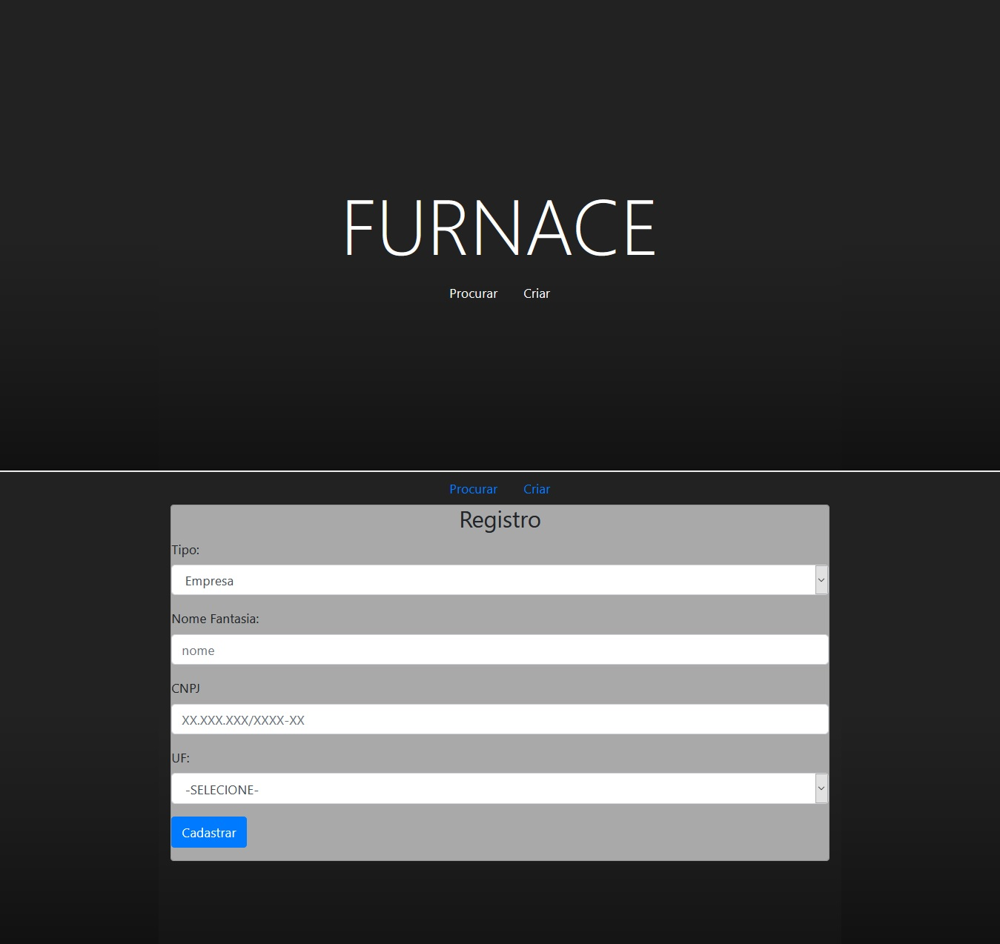

# Furnace



Furnace é uma resposta ao [Desafio Full-Stack End-To-End](#), um teste de conhecimento sobre desenvolvimento web

O Front-End foi desenvolvido com Angular 9, TypeScript e BootStrap 4, o Back-End foi desenvolvido com NodeJS e usa uma base de dados MySQL

O nome do projeto ("forno", em inglês) não tem nenhuma pretenção de fazer sentido, e só foi escolhido porque lembra "fornecimento", e o objetivo era fazer um app que gerencia a relação de empresas e fornecedores

---

### Começando:

##### Pré requisitos:

Para usar o projeto em modo de desenvolvimento, voce precisa de um gerenciador de pacotes (recomendado: [Yarn](https://classic.yarnpkg.com/en/docs/install) ou [NPM](https://www.npmjs.com/get-npm)) e um ambiente de desenvolvimento com Angular ^9, TypeScript ^4, NodeJS ^12 e um servidor MySQL ^5.7

##### Clonando o repositório, e instalando todas as dependências:

###### (com Yarn)

``` 
git clone https://github.com/joveem/Furnace.git
cd furnace\furnace-back-end
yarn
cd ..\furnace-front-end\
yarn
#
```

###### (com NPM)

``` 
git clone https://github.com/joveem/Furnace.git
cd furnace\furnace-back-end
npm install
cd ..\furnace-front-end\
npm install
#
```

###### (apenas clonagem)

``` 
git clone https://github.com/joveem/Furnace.git
cd furnace
#
```
##### Banco de dados:

~~~~sql

CREATE DATABASE furnace;

USE furnace;

CREATE TABLE `company` (
  `id` int NOT NULL AUTO_INCREMENT,
  `name` varchar(32) NOT NULL,
  `cnpj` varchar(14) NOT NULL,
  `uf` int NOT NULL,
  PRIMARY KEY (`id`)
);

CREATE TABLE `provider` (
  `id` int NOT NULL AUTO_INCREMENT,
  `name` varchar(32) NOT NULL,
  `document` varchar(14) NOT NULL,
  `is_legal_person` tinyint(1) NOT NULL,
  `birthday` date DEFAULT NULL,
  PRIMARY KEY (`id`)
);

CREATE TABLE `supply` (
  `id` int NOT NULL,
  `company_id` int NOT NULL,
  `provider_id` int NOT NULL,
  PRIMARY KEY (`id`)
);

ALTER TABLE `supply`
  ADD CONSTRAINT `supply_ibfk_1` FOREIGN KEY (`company_id`) REFERENCES `company` (`id`) ON DELETE RESTRICT ON UPDATE RESTRICT,
  ADD CONSTRAINT `supply_ibfk_2` FOREIGN KEY (`provider_id`) REFERENCES `provider` (`id`) ON DELETE RESTRICT ON UPDATE RESTRICT;

~~~~

#### Executar servidores:

###### (Na pasta furnace-front-end)
~~~~
node .
~~~~

###### (Na pasta furnace-back-end)
~~~~
ng serve --proxy-config proxy.config.js
~~~~

O projeto Front-End vai ficar hospedade em http://localhost:4200/ e o Back-End em http://localhost:2929/ e com um proxy em http://localhost:4200/api/

#### Testar API:

Importe as chamandas [Postman](documentation/api-requests/furnace-postman-collection.json) e [Insomnia](documentation/api-requests/furnace-insomnia-collection.har) para fazer os teste, mas antes leia as observações.

---

### Observações:

Não consegui terminar todos os requisitos dentro do prazo, vou listar os requisitos que não estão prontos, os do teste e os que eu coloquei para mim mesmo

##### Requisitos ausentes:
- Relações de fornecimento, entre empresas e fornecedores
- Listagem de Relação de fornecimento
- Implementar dockerfile, nunca fiz isso antes, imagino que deva ser algo relacionado a preparar as variaveis de ambiente e conteiners

##### Altereções que eu queria fazer mas ficaram pendendes por causa do tempo:
- Configurar o roteamento do Front-End
- Implementar os filtros por nome, documentos e tipo na lista de Empresas e Fornecedores
- Fazer uma validação dos dados de cadastro no Front-End e outra no Back-End
- Preparar o Back-End para error manuais, por exemplo: mostrar uma entidade por um ID que não está cadastrado, por causa da falta de roteamento isso só acontece com uma requisição externa, porque no Front-End só é possivel abrir os detalhes de um usuario se ele aparecer na lista, e ele só aparece lá se existir, mas com as rotas, isso pode acontecer com um link de um usuario que foi apagado ou algo do genero
- Colocar confirmações antes de apagar, ou alterar uma entidade
- Comentar melhor o código
- Padronizar a depuração (Front-End e Back-End)
- Juntar as duas tabelas de Empresas e Fornecedores em uma só, na base de dados 
- Melhorar o design (no final, o projeto ficou com o design de testes)